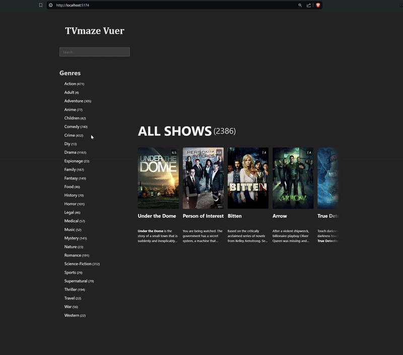

# TVmaze Vuer

This is a simple vue3 app that consumes [TVmaze api](https://www.tvmaze.com/api) to show tv shows.

### Mobile version 👇🏻


### Desktop version 👇🏻



## Features, Decisions and Thoughts

### Screens

This app has multiple screens:

1. A **Home Screen** (accessible through `/`) that is responsible for navigating through the show index sequentially as they are returned from the API,

   > Note that this is the only page where the user can fetch more shows as they keep on scrolling horizontally.
   > Note that with every shows API call, the whole state is stored in `localStorage` and upon app startup, the state is initialized with its last value from `localStorage`.

   > Also The horizontally scrollable list of shows on the **Home Screen** is an `IntersectionObserver` and it's observing the intersection of the last element in the list. When it intersects, a fetch of the next page from the API is triggered.

2. A **Genre Screen** (accessible through `/genres/:genreId`) that is responsible for displaying a horizontal list of shows under a specific genre, but here shows are ordered by their rating,

3. A **DetailedView Screen** (accessible through `/shows/:showId`) that is responsible for displaying information for a specific show,

   > ⚠️ Please note that this screen can be much more appealing and user-friendly, but for the sake of time I decided not to spend much time perfecting it.

There's also a **Side Menu** component that is fixed as part of the page layout for desktop screens and is a sliding menu for mobile screens.

> There's a composable function that I am using to track media query `useMediaQuery.ts` for that.

### Application State

I used [Pinia](https://pinia.vuejs.org/) state manages to manage app state for easier management of it and better separation of concerns between UI components and state.

When a new page of shows is fetched from the API, first I validate it using a [Zod](https://zod.dev/) defined schema so that at runtime I know I have a valid type. Then I store the shows indexed by `id` under `state.showsById`.

```typescript
type ShowsById = Record<Show["id"], Show>;
```

Since one the functional requirements was to have genre pages where shows are filtered by that `genre` and ordered by `rating`; I created another data structure in app state `state.showIdsByGenre` to make the read process for these pages faster by a nesting record of show `id`s indexed by show `rating` for each show `genre`.

In other words:

```typescript
type ShowIdsByGenre = Record<
  Show["genre"][number], // string
  Record<
    Show["rating"]["average"], // number
    Show["id"][]
>;

const example: ShowIdsByGenre = {
  action: {
    9.5: [1, 43, 220]
    7: [11]
  },
  romance: {
    9.5: [13]
    8.3: [16, 13]
    6.9: [90, 54, 32]
  },
  ...
}
```

And when the **Genre Screen** wants to read shows for a specific show `genre`; for that `genre` I get a list of show `id`s easily since we will always have a finite number of show `rating` variations like [8.0, 8.1, 8.2, 8.3, etc...]

### Application Routing

I used [vue-router](https://router.vuejs.org/) for this app's routing. And as mentioned earlier this app has some routes:

- `/` - Home Screen
- `/genres/:genreId` - Genre Screen
- `/shows/:showId` - DetailedView Screen
- `/404` - Not Found page (there's another wildcard route that redirects to this one for any route that is not defined here)

### Horizontal Scrolling Component

I used an open source huge list virtualization vue package [vue-virtual-scroller](https://www.npmjs.com/package/vue-virtual-scroller) as an optimization for the as the performance starts taking a hit once the shows list in memory start to increase to more than 10,000 items.

This keeps the app UI performant as only some items are mounted in the dom depending on where the user is scrolling in the long list.

## How To Run

This project is using node.js version `v20.15.0` and npm version `v10.7.0`.

Simply clone the repository and then in your command line run:

```sh
# to install dependencies
npm install

# to run locally
npm run dev
```

## TODOs

If I had a couple more dedicated days for this task, what I would do to improve it:

1. Add [vitest](https://vitest.dev/) package and use it to test to some parts, especially:

   - State. I would like to do integration tests for the pinia store to assert that as a black box it works as I expect it to work,
   - Some page components like **Genre Screen** and **DetailedView Screen** rely on a reactive param values read from vue router, So I'd test that these are reacting properly to param changes,
   - Utils,

2. Consider using `Tailwind` for a more convenient way of styling.

3. Add more details and information to the **DetailedView Screen**
